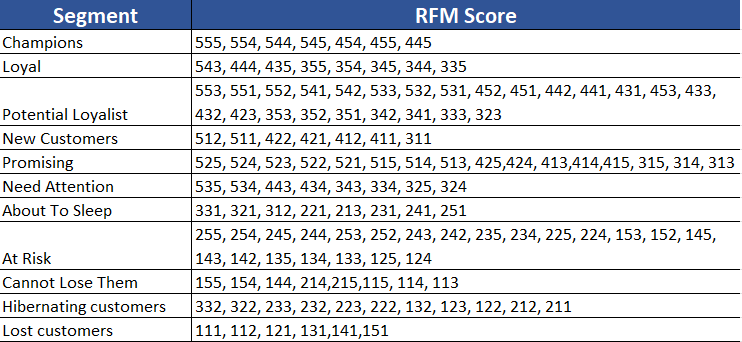
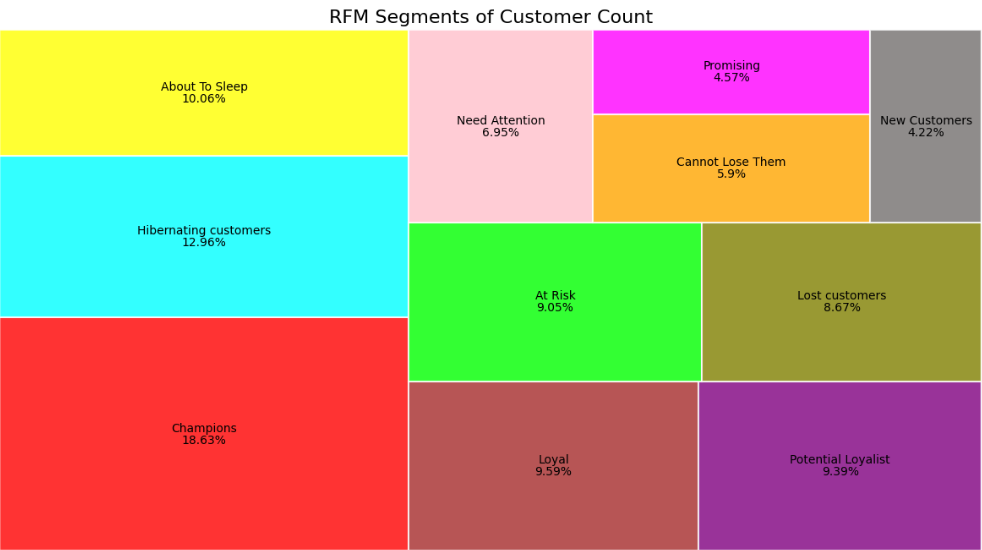
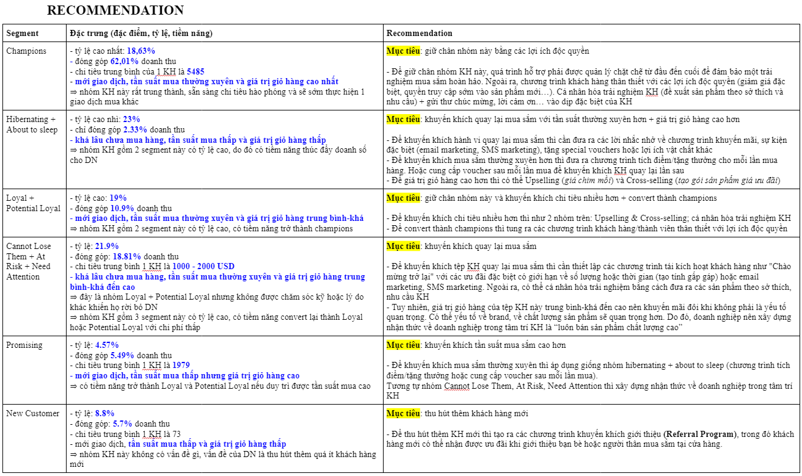

## OVERVIEW
An online retailer needs to offer a diverse range of products. To optimize marketing and sales strategies, the company uses RFM (Recency, Frequency, Monetary) analysis to segment its customer base. This segmentation helps tailor strategies for different customer groups. For instance, loyal customers (Champions) can receive exclusive offers, potential loyalists can be targeted with promotions, and at-risk customers can be re-engaged with reminders and special offers. New customers can be welcomed with discounts, and inactive customers can be reactivated with significant promotions. RFM segmentation provides valuable insights, allowing company to enhance customer satisfaction, loyalty, and revenue.

## DETAIL
- **Data Collection** based on customer transactions, including the date of the last purchase, the total number of purchases, and the total amount spent.

- **Calculate RFM Metrics:**
**Recency**: Calculate the number of days since the last purchase for each customer.
**Frequency**: Count the total number of purchases each customer has made.
**Monetary**: Sum the total amount spent by each customer.
  
- **Score RFM**:
Divide the customers into quartiles for each RFM metric. This means splitting the customers into 5 groups based on their scores.
Assign scores from 1 to 5 for each metric, where 1 is the lowest quartile and 5 is the highest quartile. The scoring can be interpreted as follows:
**Recency**: The most recent buyers get a score of 5, while the least recent get a score of 1.
**Frequency**: The most frequent buyers get a score of 5, while the least frequent get a score of 1.
**Monetary**: The highest spenders get a score of 5, while the lowest spenders get a score of 1.

## STRATEGY

